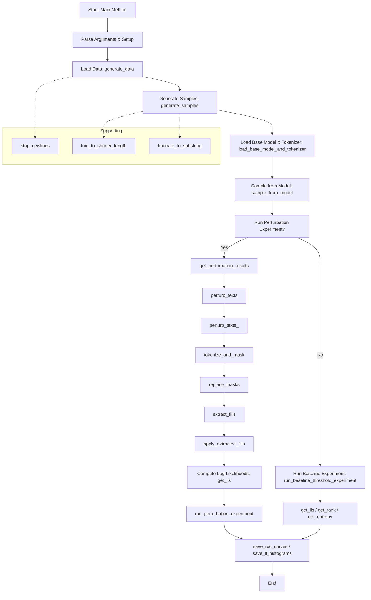

# DetectGPT Pipeline Flow Diagram

This diagram outlines the order of function calls in `run.py`, starting from the main method. It shows the high-level flow and when each major function is invoked during a typical experiment run.

**How to read this diagram:**
- The flow starts at the main method and proceeds through argument parsing, data loading, and model setup.
- Depending on the experiment type, it either runs a perturbation experiment (left branch) or a baseline experiment (right branch).
- Each box represents a function call or major step, with arrows showing the order of execution.
- Dashed arrows indicate supporting functions that are called as helpers within the main flow.

---

This diagram provides a high-level overview. For more detail, refer to the function explanations in `explanations.md`.
