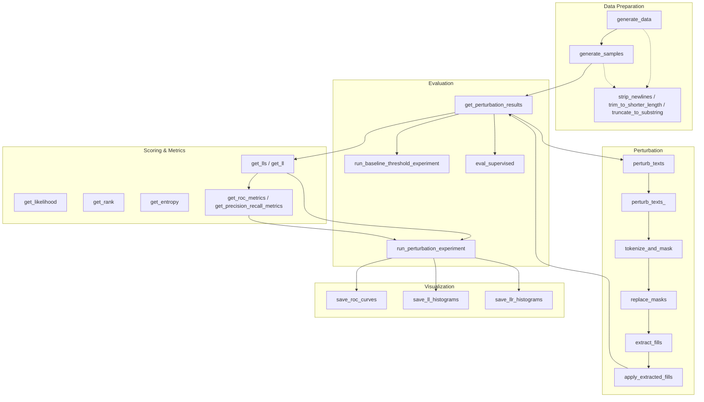

# DetectGPT Module & Function Map

This diagram shows the relationships between the main modules and functions in the DetectGPT codebase, with a focus on the core logic for text perturbation, likelihood computation, and evaluation.

**Legend:**
- **Data Preparation:** Loading, cleaning, and sampling data
- **Perturbation:** Masking and filling text to create perturbed versions
- **Scoring & Metrics:** Computing likelihoods, ranks, entropy, and evaluation metrics
- **Evaluation:** Running experiments to distinguish real vs. AI-generated text
- **Visualization:** Plotting and saving results
- Dashed arrows indicate supporting/helper functions

---
This map helps you see how the main components interact and where the core logic for text alteration and evaluation resides.
